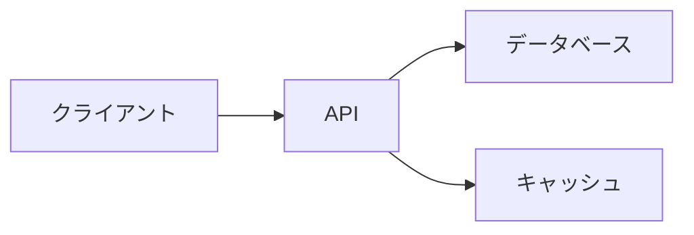

# README作成のベストプラクティス

高品質で効果的なREADMEファイルを作成するための包括的なガイド。

## 目次

1. [基本原則](#基本原則)
2. [構造とフォーマット](#構造とフォーマット)
3. [コンテンツガイドライン](#コンテンツガイドライン)
4. [コード例](#コード例)
5. [視覚要素](#視覚要素)
6. [アクセシビリティ](#アクセシビリティ)
7. [メンテナンス](#メンテナンス)
8. [避けるべきこと](#避けるべきこと)

---

## 基本原則

### 1. 明確さを優先

**✅ 良い例:**
```markdown
## インストール

```bash
npm install my-package
```

パッケージをインストールしたら、アプリケーションで使用できます。
```

**❌ 悪い例:**
```markdown
## セットアップ

npmまたはyarnを使用してインストールできます（Node.js環境が必要です）。
または、CDNからもロードできます。他のオプションもあります...
```

**理由:**
- 簡潔で直接的な説明
- 一つのアクションに焦点
- 不要な情報を避ける

### 2. 読者を想定

**初心者向け:**
```markdown
## インストール

まだNode.jsをインストールしていない場合は、[nodejs.org](https://nodejs.org)からダウンロードしてください。

次に、ターミナルを開いて実行：
```bash
npm install my-package
```
```

**経験者向け:**
```markdown
## インストール

```bash
npm install my-package
```
```

**理由:**
- オーディエンスに合わせた詳細度
- 適切なコンテキストを提供
- 前提知識を考慮

### 3. スキャン可能に

**✅ 良い例:**
```markdown
## 機能

- **高速** - ベンチマークで他より2倍速い
- **軽量** - バンドルサイズわずか5KB
- **柔軟** - 100以上の設定オプション
- **型安全** - 完全なTypeScriptサポート
```

**❌ 悪い例:**
```markdown
## 機能

このライブラリは非常に高速で、ベンチマークテストによると
他のライブラリよりも2倍速いことが証明されています。
また、非常に軽量で、バンドルサイズはわずか5KBで、
多くの設定オプションがあり...
```

**理由:**
- 箇条書きは読みやすい
- 太字で重要な点を強調
- 情報を素早く見つけられる

### 4. 例を示す

**✅ 良い例:**
```markdown
## 使い方

```javascript
const analyzer = require('data-analyzer');

// CSVファイルをロード
const data = analyzer.load('sales.csv');

// 平均を計算
const average = analyzer.mean(data.revenue);
console.log(`平均収益: $${average}`);
// 出力: 平均収益: $12,450
```
```

**❌ 悪い例:**
```markdown
## 使い方

load()関数を使用してデータをロードし、
mean()を使用して平均を計算できます。
```

**理由:**
- 実際のコードは理解しやすい
- 期待される出力を表示
- コピー＆ペースト可能

---

## 構造とフォーマット

### マークダウンの階層

**✅ 良い例:**
```markdown
# メインタイトル

## 主要セクション

### サブセクション

#### 詳細な項目
```

**❌ 悪い例:**
```markdown
# タイトル

### サブセクション

## 主要セクション
```

**理由:**
- 論理的な階層
- H1は一度だけ使用
- 一貫したレベル

### 一貫したフォーマット

**コードブロック:**
```markdown
<!-- 常に言語を指定 -->
```javascript
const code = "このように";
```

<!-- ではなく -->
```
const code = "このように";
```
```

**リスト:**
```markdown
<!-- 一貫したマーカーを使用 -->
- 項目1
- 項目2
  - サブ項目2.1
  - サブ項目2.2

<!-- 混在しない -->
- 項目1
* 項目2
  - サブ項目
```

### 適切な間隔

**✅ 良い例:**
```markdown
## セクション1

コンテンツ

## セクション2

コンテンツ
```

**❌ 悪い例:**
```markdown
## セクション1
コンテンツ
## セクション2
コンテンツ
```

---

## コンテンツガイドライン

### 説明文

**効果的な説明:**
```markdown
> 大規模なデータセットを扱う開発者のための高速で信頼性の高い
> データ分析ライブラリ。複雑な統計計算を簡素化します。
```

**含めるべき内容:**
1. 何をするか
2. 誰のためか
3. なぜユニークか
4. 主な利点

**避けるべきこと:**
- 曖昧な表現
- マーケティング用語
- 過度な誇張

### インストール手順

**包括的なインストール:**
```markdown
## インストール

### 前提条件

- Node.js 14以上
- npm 6以上

### パッケージマネージャー

**npm:**
```bash
npm install package-name
```

**yarn:**
```bash
yarn add package-name
```

**pnpm:**
```bash
pnpm add package-name
```

### CDN

```html
<script src="https://cdn.example.com/package-name@1.0.0/dist/package.min.js"></script>
```

### 検証

インストールが成功したことを確認：

```bash
package-name --version
```
```

### 使用例

**段階的な例:**
```markdown
## 基本的な使い方

### ステップ1: インポート

```javascript
import Analyzer from 'data-analyzer';
```

### ステップ2: 初期化

```javascript
const analyzer = new Analyzer({
  precision: 2,
  format: 'json'
});
```

### ステップ3: データを処理

```javascript
const data = [1, 2, 3, 4, 5];
const result = analyzer.mean(data);
console.log(result); // 3.00
```

### 完全な例

```javascript
import Analyzer from 'data-analyzer';

const analyzer = new Analyzer({
  precision: 2,
  format: 'json'
});

const data = [1, 2, 3, 4, 5];
const result = analyzer.mean(data);
console.log(result); // 3.00
```
```

### API ドキュメント

**明確なAPIドキュメント:**
```markdown
### `analyze(data, options)`

データセットの統計分析を実行。

#### パラメータ

| 名前 | 型 | 必須 | デフォルト | 説明 |
|------|-----|------|-----------|------|
| `data` | Array | はい | - | 分析するデータ配列 |
| `options` | Object | いいえ | `{}` | 設定オプション |
| `options.method` | String | いいえ | `'mean'` | 分析手法 |
| `options.precision` | Number | いいえ | `2` | 小数点以下の桁数 |

#### 戻り値

**型:** `Object`

```javascript
{
  value: Number,      // 計算された値
  confidence: Number, // 信頼区間（0-1）
  sample: Number      // サンプルサイズ
}
```

#### 例

```javascript
const result = analyze([1, 2, 3, 4, 5], {
  method: 'median',
  precision: 3
});

console.log(result);
// {
//   value: 3.000,
//   confidence: 0.95,
//   sample: 5
// }
```

#### エラー

- `TypeError` - dataが配列でない場合
- `RangeError` - precisionが0未満または10超の場合
- `ValidationError` - dataが空の場合
```

---

## コード例

### 質の高いコード例

**✅ 良い例:**
```javascript
// ユーザーデータをフェッチして処理
async function processUserData(userId) {
  try {
    // APIからユーザーをフェッチ
    const response = await fetch(`/api/users/${userId}`);
    const user = await response.json();
    
    // データを検証
    if (!user || !user.email) {
      throw new Error('無効なユーザーデータ');
    }
    
    // データを処理
    const processed = {
      id: user.id,
      name: user.name.toUpperCase(),
      email: user.email.toLowerCase()
    };
    
    return processed;
  } catch (error) {
    console.error('ユーザー処理エラー:', error);
    throw error;
  }
}

// 使用方法
processUserData(123)
  .then(user => console.log('処理済み:', user))
  .catch(err => console.error('失敗:', err));
```

**特徴:**
- コメントで説明
- エラーハンドリング
- 完全な例
- 実際のユースケース

**❌ 悪い例:**
```javascript
fetch('/api/users/' + id).then(r => r.json()).then(u => process(u));
```

### コメントの使用

**効果的なコメント:**
```python
# ユーザー入力からHTMLタグを削除
def sanitize_input(text):
    """
    危険なHTMLタグと属性を削除してユーザー入力をサニタイズ。
    
    Args:
        text (str): サニタイズする入力テキスト
        
    Returns:
        str: サニタイズされたテキスト
        
    Example:
        >>> sanitize_input('<script>alert("XSS")</script>Hello')
        'Hello'
    """
    import re
    # すべてのHTMLタグを削除
    clean = re.sub('<.*?>', '', text)
    return clean.strip()
```

### 出力を表示

**期待される出力:**
```markdown
```bash
npm start
```

出力:
```
Server running on http://localhost:3000
Database connected successfully
Ready to accept connections
```
```

---

## 視覚要素

### スクリーンショット

**効果的なスクリーンショット:**
```markdown
## デモ

### メインダッシュボード


**主な機能:**
- リアルタイムデータビジュアライゼーション
- カスタマイズ可能なウィジェット
- ダークモードサポート
```

**ベストプラクティス:**
- 高解像度の画像（2x for retina）
- 適切なサイズ（幅600-800px）
- 説明的な代替テキスト
- docsフォルダーに保存
- 機能を強調

### GIFとビデオ

**GIFデモ:**
```markdown
## クイックデモ


*ユーザーを作成してデータを分析する様子*
```

**ベストプラクティス:**
- 短く保つ（5-10秒）
- ファイルサイズを最適化（< 5MB）
- キャプションを追加
- 主要な機能を表示
- ループを適切に設定

### 図とダイアグラム

**アーキテクチャ図:**
```markdown
## アーキテクチャ

```
┌─────────────┐      ┌─────────────┐      ┌─────────────┐
│   クライアント   │ ───> │   APIゲートウェイ   │ ───> │  データベース  │
└─────────────┘      └─────────────┘      └─────────────┘
                            │
                            ▼
                     ┌─────────────┐
                     │  キャッシュ   │
                     └─────────────┘
```
```

または Mermaid を使用:
```markdown

```

### 絵文字の使用

**適度な使用:**
```markdown
## 機能

- 🚀 **高速** - パフォーマンス最適化
- 🔒 **安全** - エンドツーエンド暗号化
- 🎨 **カスタマイズ可能** - 完全にテーマ対応
- 📱 **レスポンシブ** - モバイルフレンドリー
```

**ガイドライン:**
- 視覚的な興味のためにのみ使用
- 過度な使用を避ける
- 一貫したスタイルを維持
- 意味のある絵文字を選択

---

## アクセシビリティ

### 代替テキスト

**✅ 良い例:**
```markdown

```

**❌ 悪い例:**
```markdown

```

### 説明的なリンク

**✅ 良い例:**
```markdown
詳細については[インストールガイド](docs/install.md)を参照してください。
```

**❌ 悪い例:**
```markdown
[ここをクリック](docs/install.md)して詳細を確認。
```

### 見出し階層

**✅ 良い例:**
```markdown
# プロジェクトタイトル (H1)

## 主要セクション (H2)

### サブセクション (H3)

#### 詳細 (H4)
```

**❌ 悪い例:**
```markdown
# タイトル (H1)

#### サブセクション (H4) ← H2とH3をスキップ
```

### 色の使用

**アクセシブルなコントラスト:**
```markdown
<!-- 良い: 高コントラスト -->


<!-- 避ける: 低コントラスト -->

```

---

## メンテナンス

### 最新に保つ

**定期的に更新:**
- ✅ バージョン番号
- ✅ 依存関係
- ✅ スクリーンショット
- ✅ コード例
- ✅ リンク

**変更履歴:**
```markdown
## 変更履歴

### [2.0.0] - 2025-01-15
- 新しいAPI v2
- 破壊的変更: 古いエンドポイントを削除
- パフォーマンス改善

### [1.5.0] - 2024-12-01
- TypeScriptサポートを追加
- バグ修正
```

### リンクの検証

**定期的にチェック:**
```bash
# リンクチェッカーを使用
npm install -g markdown-link-check
markdown-link-check README.md
```

### 破壊的変更

**明確に通知:**
```markdown
## ⚠️ バージョン2.0への移行

### 破壊的変更

1. **API変更**
   ```javascript
   // 古い (v1.x)
   analyzer.analyze(data, 'mean')
   
   // 新しい (v2.x)
   analyzer.analyze(data, { method: 'mean' })
   ```

2. **削除されたメソッド**
   - `oldMethod()` - 代わりに `newMethod()` を使用
   
3. **名前変更**
   - `config` → `options`

### 移行ガイド

完全な移行ガイドは [MIGRATION.md](MIGRATION.md) を参照。
```

---

## 避けるべきこと

### 一般的な間違い

**❌ 長すぎる段落**
```markdown
このプロジェクトは...（200語の段落）
```

**✅ 短い段落**
```markdown
このプロジェクトは[主な目的]を実現します。

主な機能:
- 機能1
- 機能2
```

**❌ 技術用語の過剰使用**
```markdown
このライブラリはパラダイムシフト的なアプローチで
シナジーを最大化し、レバレッジを活用...
```

**✅ 明確な言語**
```markdown
このライブラリは開発を簡素化し、
コードを読みやすくします。
```

**❌ 不完全な情報**
```markdown
## インストール

npmを使用してインストール。
```

**✅ 完全な指示**
```markdown
## インストール

```bash
npm install package-name
```

または yarn:
```bash
yarn add package-name
```
```

### 避けるべきパターン

**マーケティング用語:**
```markdown
❌ 革命的な、画期的な、業界をリードする
✅ 高速、信頼性が高い、使いやすい
```

**曖昧な記述:**
```markdown
❌ 簡単にセットアップできます
✅ 3つのコマンドでセットアップ（5分未満）
```

**古い情報:**
```markdown
❌ Node.js 6+ 必須（古い）
✅ Node.js 18+ 必須
```

---

## チェックリスト

### READMEを公開する前に

基本:
- [ ] プロジェクト名とロゴ
- [ ] 明確な説明
- [ ] インストール手順
- [ ] 基本的な使用例
- [ ] ライセンス情報

品質:
- [ ] すべてのリンクが機能する
- [ ] コード例がテスト済み
- [ ] スクリーンショットが最新
- [ ] 文法とスペルをチェック
- [ ] 一貫したフォーマット

アクセシビリティ:
- [ ] 代替テキスト付き画像
- [ ] 適切な見出し階層
- [ ] 説明的なリンクテキスト
- [ ] 十分な色のコントラスト

追加:
- [ ] バッジ（該当する場合）
- [ ] コントリビューションガイド
- [ ] FAQ またはトラブルシューティング
- [ ] 連絡先情報
- [ ] 変更履歴

---

## テンプレートとツール

### テンプレートの使用

**基本テンプレート:**
```markdown
# プロジェクト名

> 簡潔な説明

## 機能

- 機能1
- 機能2

## インストール

```bash
npm install project
```

## 使い方

```javascript
// コード例
```

## ライセンス

MIT
```

### 役立つツール

**リンター:**
- [markdownlint](https://github.com/DavidAnson/markdownlint)
- [remark-lint](https://github.com/remarkjs/remark-lint)

**ジェネレーター:**
- [readme-md-generator](https://github.com/kefranabg/readme-md-generator)
- [standard-readme](https://github.com/RichardLitt/standard-readme)

**バリデーター:**
- [markdown-link-check](https://github.com/tcort/markdown-link-check)
- [awesome-lint](https://github.com/sindresorhus/awesome-lint)

---

## 追加リソース

### ガイドとスタンダード

- [GitHub README Guide](https://docs.github.com/en/repositories/managing-your-repositorys-settings-and-features/customizing-your-repository/about-readmes)
- [Standard README](https://github.com/RichardLitt/standard-readme)
- [Art of README](https://github.com/hackergrrl/art-of-readme)

### 例

- [Awesome README](https://github.com/matiassingers/awesome-readme)
- [README Examples](https://github.com/matiassingers/awesome-readme/blob/master/readme-EXAMPLES.md)

### マークダウンリファレンス

- [GitHub Flavored Markdown](https://github.github.com/gfm/)
- [Markdown Guide](https://www.markdownguide.org/)
- [CommonMark](https://commonmark.org/)
